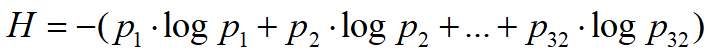
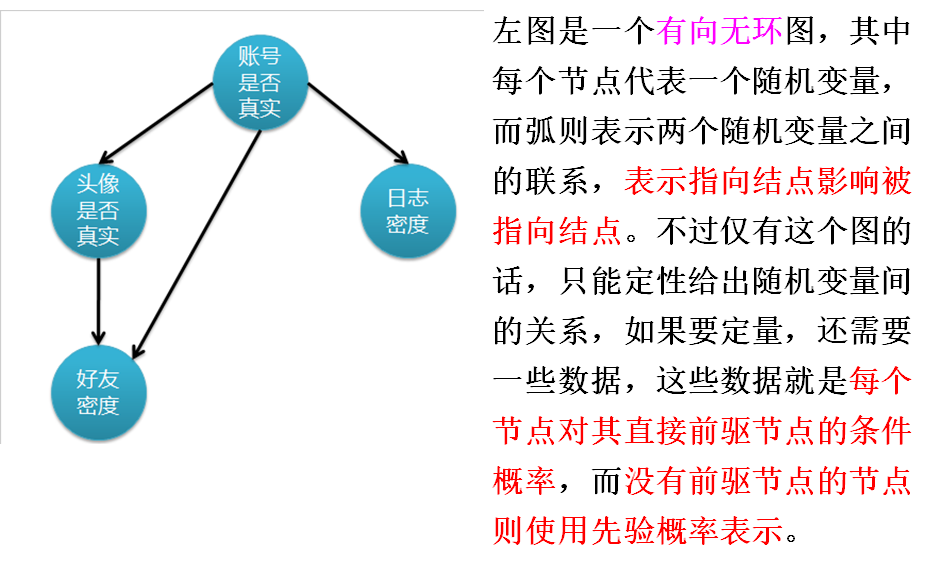

# 分类和预测

## 定义

分类：用于预测数据对象的分类标号。

预测：用于预测数据对象的**连续值或者有序值**

## 使用分类步骤

### 第一步：学习建模

（1）建立分类模型：利用分类算法对训练集进行训练，得到分类模型，这就是**“有指导的学习”**。

***

分类的是实现——利用模型预测

分类模型的效果要进行评判，需要把数据分层训练集和测试集，**modeler中就是分区**。一般测试集在30%左右。

### 第二步：使用模型进行分类

（2）使用模型进行分类：

- 测试数据集：用于评估模型的预测准确率。
  - 测试集要独立于训练样本集，否则就会出现“过分适应数据”的情况
  - 对每个测试样本，将已知的类标号和该样本的学习模型类预测比较，模型在给定测试集上的准确理是正确被模型分类的测试样本百分比。
- 如认为模型准确率可以接收，就可以用它来对类标号未知的数据元组进行分类。

***

> ​	**分类的核心是归纳**，归纳是从特殊到一般的过程。归纳推理从若干个事实表征出的特征中，通过比较、总结、概括而得出的一个规律性结论。

### 分类问题的一般化方法

归纳学习存在基本假设：

* 假设如果能够在足够大的训练样本集中很好地逼近目标函数，则它也能在未见样本中很好地逼近目标函数。
* 该假定是归纳学习有效性的前提条件

## 分类性能的度量

***

> ​	评价分类性能的好坏，需要采取一定的评价指标和准则

### 查全率、查准率和F1

* **对于二分类问题**，可将样例根据真实类别与机器学习预测类别的组合划分为**真正例TP（True positive）、假正例FP（false positive）、真反例TN(TRUE NEGATIVE)、假反例FN（FALSE NEGATIVE）**这四种情况
* 分类结果可以用混淆矩阵表示

* 查准率、查全率和F1

* 查准率

  > ​	查全率就是实际和预测相同的，除以所有

* 查全率

  > ​	查全率也叫做召回率，所有正例中（这里的正例是指实际上是正确的），正确返回了多少

**查准率和查全率是一对矛盾的度量，一般查准率高时，查全率往往偏低；而查全率高时，查准率往往偏低**

***

F1的度量：，**F2是查准率和查全率的调和平均**

> ​	如果有时候在一些应用中，对查准率和查全率的重视程度不同，是可以加权重的

β>1查全率有更大影响，β<1查准率有更大影响

***

对于滴多分类问题：

### ROC曲线

很多机器学习为测试样本产生一个**实值或者预测概率**，然后大于阈值分为正，小于则为反。然后对结果样例进行排序，最可能的正例方最前面，最不可能的放后面，按照顺序逐个把样本作为正例进行预测，每次都要计算两个重要值，**FPR和TPR**,就可以得出ROC曲线。

> TPR=TP/(TP/FN)
>
> FPR=FP/(FP+TN)

这个图明显可以看到如果曲线更加上面，预测就是更加准确，**比较合理比较就是利用曲线和X轴的面积衡量，越大就越好**

***

## 决策树

决策树是一种简单且应用广泛的预测方法

决策树又称为判定树，是运用分类的一种树结构，其中每个内部节点表示一次测试，每条边代表一个测试结果，**叶节点**代表某个**类**或者**类的分布**，最上面的是**根节点**

## 决策数生成

决策树生成有两个阶段：

* 决策树构建
  * 开始时，所有的训练样本都·在根节点
  * 递归的通过选定的属性，来划分样本（必须是离散值）
* 树剪枝
  * 许多分枝反映的是训练数据中的噪声和孤立点，树剪枝试图剪去这种分歧

## 决策树可以用于两个目的

* 描述性建模：分类模型可以作为解释工具，用于区分不同类中的对象；
* 预测性建模：分类模型还可以用于预测未知记录的类标号

## 决策树的特点

* 决策树体现了对样本数据不断分组的过程。每个节点都是具有一定样本量的样本，**根节点的样本量最大，其他节点的样本量依层递减**。
* 决策树分为分类树和回归树。对于分类树，叶节点的预测值是该样本输出变量值的雷贝；对于回归树，叶节点的预测值是该样本输出变量值的平均值。
* 决策树体现了输入变量和输出变量的逻辑关系。类似于IF-ELSE关系这种。

## 决策树的核心问题

决策树归纳的学习算法必须解决两个核心问题之一：

* 如何**从众多的输入变量中选择一个当最佳的分组变量**

* 如何**从分组变量的众多取值中找到一个最佳分割点**

  > * **决策树生成的核心算法是确定决策树的分支准则，即选择某个属性作为测试条件**
  >
  > *	决策树的剪枝：决策树可能出现过拟合现象，（过拟合是指因失去一般代表性而无法用于对新数据的分类预测，这种现象叫做“过拟合”）

## 决策树算法

> ​	**注意，下面各种纯度的算法，都是针对一个数据集，因为一般分类会分成多个数据集，各种增益，都要用初始增益减去多个数据集的纯度的加权平均**

### CLS算法

### ID3算法

ID3算法针对**属性选择问题**，ID3算法是决策树学习方法中最具影响和典型的算法。

这个方法用到了**信息增益**选择测试属性。

当我们获取信息时候，可以将不确定的内容转为确定的内容，但**获取信息有用和无用之分或者说有重要程度之分。选择属性的时候，进行要样本纯**

***

#### 信息熵

P1,P2,...P32分别是这32个求对获胜的概率

#### 计算信息增益

* 信息增益被定义为**原始的分割的熵**与**按某一属性划分后各个分割的熵的累加得到的总熵**之间的**差**
* 信息增益是划分前后进行正确预测苏哦需要信息量之差。
* 选择具有**最高信息增益的属性**作为当前节点的测试属性。

#### 基尼（Gini)指数

#### 误分类错误

### 决策树算法的探讨

#### 冗余和不相关属性

* 一个属性如果和另一个属性强相关，那么他就是冗余的。在==两个冗余属性中，如果已经选择一个作为用于划分的属性，则另一个将被忽略，冗余属性不会对决策树的精准性有影响。==
* 如果数据集中有很多与目标属性不相关的属性（即对分类任务没有用的属性），则某些不相关的属性可能在树的构造过程中偶然被选中，==导致决策树过于庞大==。
* ==构建决策树分类模型时，在预处理阶段需要删除不相关的属性==，冗余属性的保留使得进入分裂属性的选择具有随机性。

#### ID3算法小结

> ​	ID3算法的基本思想：以**信息熵**为度量，用于决策树节点的属性选择，每次优先选取**信息增益**最多的属性，==以构造一棵熵值下降最快的决策树==，到叶子节点处的熵值为0.

- 基本的决策树生成算法是一个**贪心算法**，采取==自上而下、分而治之==的递归方式来构造。
- 决策树是一种自顶向下增长树的==贪心算法==，==在每个节点它都希望选取的是当前最好分类样本的属性==，继续这个过程直到这棵树能完美地分类训练集，或所有的属性已经被用过。
- 算法的重点是**属性的选取**
- 贪心算法的缺点是**局部最优**。

#### 对于二类问题：

> ​	横坐标为属于其中一个类的概率

三种方法都在类分布均衡时（即当p=0.5)达到最大值，而当所有记录度属于同一个类（p=0或p=1)时达到最小值。

#### 如何选择属性测试条件

***

取决于属性类型：

* 标称
* 有序
* 连续

***

取决于分裂的“路”数：

* 二路分裂
* 多路分裂

***

##### 基于**标称属性**的分裂：

* 多路分裂：有多少不同的属性，就划分为多少个子集。

  

* 二路分裂：将记录集分为两个子集需要找到最佳的划分。

  

对于**有序属性**的分裂，与标称属性类似，但是要主义，不能违背==有序性==

##### 连续属性的分裂

> ​	连续属性的分裂就是将连续属性离散化，然后分裂。

#### 不纯度度量

熵和Gini指标等的不纯性度量**倾向于选择产生大量小而纯的子集的分裂方案。**

> ​	缺点：考虑如果按照员工ID来分裂，可能会产生更纯的划分，但明显顾客的ID不是一个有预测性的属性。
>
> 解决方案：
>
> * 限制测试条件只能二元划分（如CART)
> * 修改评估划分的标准，==把属性测试条件产生的**输出数**也考虑进去==（如C4.5)

#### ID3到C4.5

> ​	ID3算法解决了CLS算法中的属性选择问题，以**信息增益**为度量，用于决策树节点的属性选择。==信息增益倾向于选择产生大量小而纯的子集的分裂方案==。
>
> 而且有极端情况，如果用ID来分，那肯定是纯的，分很多类。
>
> C4.5算法对此进行改进，用**信息增益率**（用信息增益除以一个变量，这个变量随着分裂路数增大而增大）代替**信息增益**来选择属性。

#### C4.5算法

##### 对于ID3的改进

* 用==信息增益率==代替信息增益来选择属性

* 能够完成对==连续属性==的==离散化==处理。

* 能处理==属性缺失==的情况

* 在决策树构造完成后进行==剪枝==

  > ​	ID3是决策树的鼻祖算法，ID3改进成C4.5 ，C5.0仅仅是C4.5的商业化版本，基本相同。

##### 增益率

> ​	n~i~是其其中i部分记录的个数,k就是父节点分裂K个部分

* 选择有==最大信息增益率==的属性作为分裂属性
* SplitINFO的调节，使得具有高熵值的分裂方法，产生小而纯的子集方法，受到处罚。

##### 连续属性与分裂点

#### CART算法

> ​	CART(Classification and Regression Tree )算法是一种既可以处理离散变量，也可以处理连续变量的决策树。

##### CART与C4.5的差别

* 既可以处理分类型，也可以处理数值型
* 只能建立==二叉树==
* C4.5用的是信息增益率，而CART用的是==Gini系数和方差==
* C4.5算法使用**后修剪**方式，依据训练样本进行修建；CART算法使用==预修剪和后修剪==相结合的修剪方式，对测试样本集进行修剪。

##### 离散数据的处理

​	因为CART只能使用二叉树的，对于多分类，首先要将多类合并成两个类别，形成超类；

##### 数值型属性处理

###### 对于分类树

​	首先，将数据按照升序排列，然后从大到小依次以相邻数值的中间值作为组限，将样本划分两组，计算两者之间的白能量输出的差异性（其实就是Gini的差异）。按反复计算就可以得到最佳分类。

###### 对于回归树

#### 决策树总结

优点：

缺点：

* 数据碎片：因为到了下面，叶子节点记录会越来越少，不具有代表性。解决方法：==党样本数小于某个特定阈值就停止分裂==
* 重复：
* 限制连续属性之间复杂关系的建模的表达能力：每次都只能取一个属性，有些时候，东西是由两个或者两个以上属性来决定的，比如DRUG中有Na/K.

### 决策树中的问题及解决

***

- 欠拟合和过拟合
- 缺失值
- 分类成本

#### 决策树停止准则

- 当一个节点处==所有的记录属于同一类==，停止
- 当一个节点==所有记录有相似的属性值==时，停止

​	一个好的分类模型必须具有较低的训练误差和低泛化误差

- ==训练误差==：训练记录上误分类样本比例
- ==泛化误差==：模型在未知记录上的期望误差

#### 过拟合和欠拟合

##### 过拟合

随着决策树生长，处理样本不断减少，其对==数据总体规律代表程度下降==。可能是噪声引起的过拟合

解决方法：

* 预修剪：及早停止生长

  * 常见中值条件：
    * 所有的实例是同一类
    * 所有的属性值相同
  * 严格的条件：
    * 给定决策树的高度
    * 设定实例个数小于阈值

* 后修剪：

  * 修剪后==泛化错误==有所改进，则用一个叶节点替换子树

  * 用子树中最常使用的分支代替子树（就是结合业务）

    > ​	与先剪枝相比，==后剪枝技术产生结果更好==

### Modeler中决策树算法模型比较

* 选择分类模型的时候，首先要确定输出目标是什么，==输出目标标称型还是连续型==
* 标称型的用C5.0，连续性的用C&R和CHAID
* 判断是==二元还是多元的==
  * 二元的用C&R和QUEST
  * 多元的用C5.0和CHAID
* 决策树算法的核心是==决策树的分支准则==。五种算法的分支准则不同：
  * C5.0使用信息增益率
  * C&R使用基尼系数
  * QUEST使用卡方检验和方差检验
  * CHAID使用卡方检验
  * 决策列表使用统计置信度

#### Bagging技术和Boosting技术

* 与Bagging技术类似，还有另外一种技术是Boosting技术，C5.0、CHAID、QUEST、C&R，

## 其他分类技术

### 基于规则的分类

> ​	基于规则的分类就是先用if....then语句写好规则，然后把东西扔进去套

* 规则的IF部分称为==条件或者前提==，后面的称为==结论和后件==，
* 如果规则r的==前件==和个例的属性匹配，就称为==**规则r覆盖样本**==

#### 规则的质量

- 规则的覆盖率
  - 满足规则前件的所占比例
- 规则的准确率
  - 满足前件和后件的比例

#### 规则集的重要性质

- 互斥规则
  - 如果规则集R==不存在两条规则被同一条记录触发==，就称这个规则是互斥的
- 穷举规则
  - 如果对任意一个属性的组合，都有规则可以覆盖，则说规则集R有穷举覆盖

***

#### 规则分类冲突

> ​	规则可能出现问题，有些可能没有触发规则，有些可能冲突

- 规则不互斥的处理
  - 有序规则
    - 有序的规则就需要对规则进行优先级排列了，利用==准确理、覆盖了、长度或产生顺序==进行排列。
    - 这样可以确保每个记录可以用最好的规则来覆盖
    - 缺点就是排序很麻烦。
    - 排序的方法
      - 根据规则的质量排序
      - 基于类的排序
        - ==同一类==放一起
  - 无序规则集
    - 当规则无序的时候，==将规则的后件作为一个投票==，通过计票得出标号。==可以用投票的准确率来做加权==。
    - 优点：不用维护规则的顺序
    - 缺点：对测试记录分类是一件很繁重的任务，需要将测试记录的属性与规则集中的每一条规则的前件做比较。
- 规则集不能穷举处理
  - 使用缺省类，就是覆盖最大的那个

#### 如何建立规则分类器

##### 直接方法

- 直接由数据提取规则
  - 顺序覆盖法
    - 基本思想：每次为一个类学习规则，理想情况下，覆盖更多的这类，而包括很少的其他类

##### 间接方法

- 决策树法

##### 规则评估

- 准确率
- 似然比
- Laplace
- M-estimate
- FOIL信息增益

### 最邻近分类

> ​	最邻近分类很简单，就是对于一条记录，算他和其他记录的距离，得到和他最邻近的K个记录

* 对未知记录分类
  * 计算和各训练集的距离
  * 找出K个最近邻
  * 使用最近邻的类标号决定未知记录的类标号（多数表决）
* 要求
  * 存放训练记录
  * 计算记录间距离度量
  * K值，最近邻的个数

#### K值影响

K值选择很麻烦，如果太小就对==噪声敏感（有可能那些点就是噪声，样本不大偶然严重），K太大就会卷入其他类的点==

#### K-NN特点

- 是一个基于实例的学习
  - 需要一个邻近性度量来确定
- 不用建立模型，但是很麻烦
- ==对于噪声非常敏感==
- 可以生成==任意边界==
  - 决策树和规则哪些都是直线边界
- 需要适当的临近度还要==数据预处理==
  - 防止临近度被某个属性左右

### 贝叶斯分类

> ​	贝叶斯分类首先要有贝叶斯概率的基础，全概率，先验概率在这就不赘述了

##### 朴素贝叶斯分类

* 朴素贝叶斯分类最重要的假设就是，==所有的属性相互独立，但是注意，类标号和属性是由关系的，就是目标变量和属性是有关系的==，所以就有

​						**这里的X是一串属性，类似一个向量，y~i~就是类标号，所以这个条件概率的计算就会**

- P(x~i~|y~i~)的计算就是利用在这个类中这个属性的数目，除以这类的数字

这里就可以看见问题，==如果一个属性的类条件概率为0，整个后验概率就是0==

解决方法

> 朴素贝叶斯分类有很大的缺点，就是属性是相互独立的，我们都知道，属性基本情况上都是不独立的，所以就有了贝叶斯网络

##### 贝叶斯网络

> ​	贝叶斯网络着力解决特征属性之间的关系，补足了朴素贝叶斯的补足

- 贝叶斯信念网络通过==有向图==的形式来这种因果关系**量化**。
- 一个贝叶斯网络由==网络结构==和==条件概率表==两部分组成。
  - 网络结构是一个==有向无环图==，由若干**结点**和**有向弧**组成。
    - 每个结点代表一个事件或者随机变量，可以连续可以离散，但是结点的取值必须是==完备互斥==的
    - 结点之间的有向弧代表随机变量之间的因果关系，有向弧的起始节点表示==原因==，有向弧的终止结点表示结果。
  - 条件概率表：是指网络中每个节点都有一个条件概率表，==用于表示其父结点对该结点的影响==
    - 当网络中某个结点没有父节点的时候，该接待你的条件概率就是结点的==先验概率==

> ​	贝叶斯网络的主要功能是==预测和诊断==，在贝叶斯网络工作之前，要对历史数据进行训练构建贝叶斯模型。所以，==预测、诊断和训练构成了贝叶斯网络的三个主要议题==

###### 贝叶斯网络的预测

> 贝叶斯网络的预测就是==自顶向下的推理==。目的是用原因推出结果。

###### 贝叶斯网络诊断

贝叶斯网络的诊断就是==自底向上==的推理。

###### 贝叶斯网络的训练

贝叶斯网络的训练就是用现有的数据对先验知识进行修正的过程，==每一次学习都对贝叶斯网络的先验概率和条件概率进行调整，使得新的贝叶斯网络更能反映数据中蕴含的知识==

###### 贝叶斯网络的特点

- 贝叶斯网络是有向无环图，==能够清晰和直观地显示变量之间的因果关系==
- 构造网络费力，但是网络确定后，就非常容易
- 对噪音不敏感，因为是条件概率
- 因为是概率方法，对过拟合问题非常好，基本不会存在，因为算出的是概率