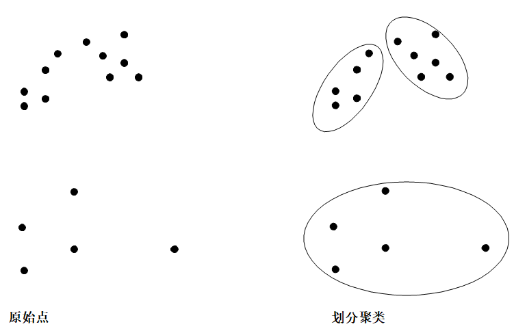
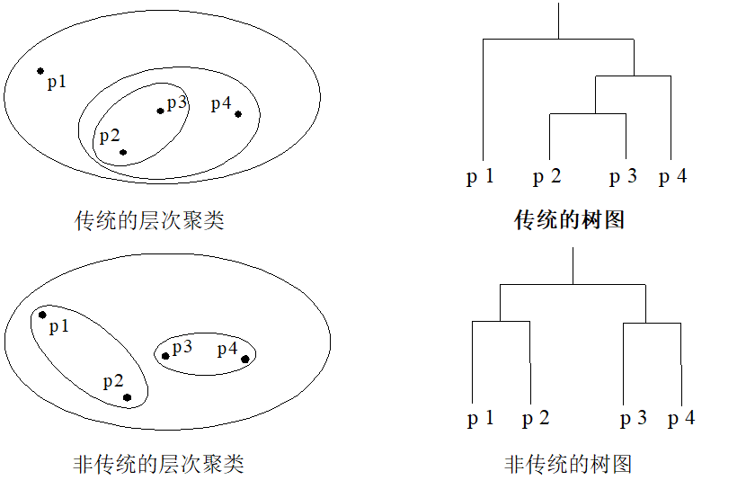
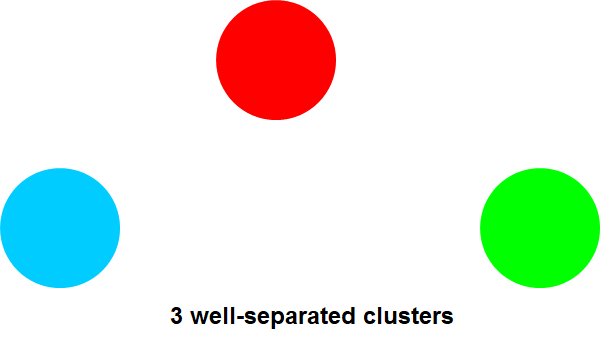
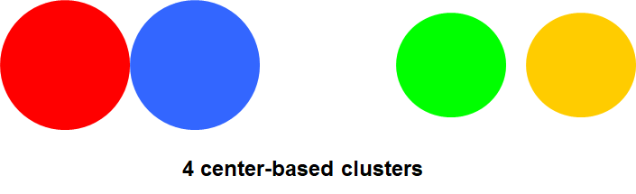
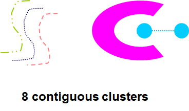
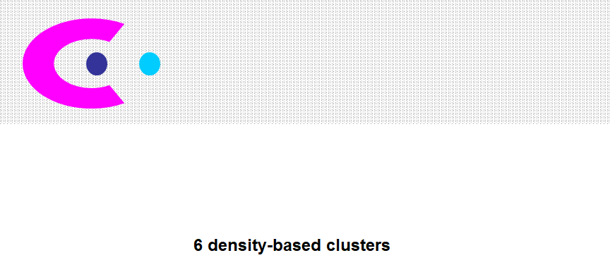
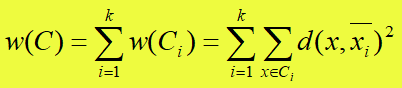
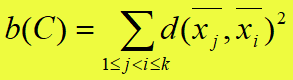
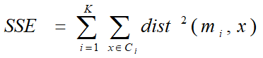
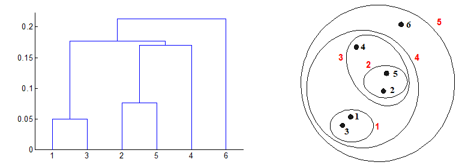

# 聚类分析

> 我们在研究事物的时候总是喜欢把事物分类，但是**分类就是有指导的学习**。但是在探索过程中，一开始是没法分类的，就需要**无指导的学习，就是聚类**。

**聚类就是希望同一组有尽可能有相同的特征，而和其他组有足够不相似**

## 聚类的概念

聚类分析就是把相似的东西规定成类，根据相似度将**研究目标进行分类**。**同一个类相似度最大化，不同类的相似度最小化。**

### 聚类和分类

- 聚类和分类的最大不同，就是**分类是有类标签，聚类是没有类标签的**。所以在聚类过后，对某一类进行规则生成有很大障碍。
- 分类的标记成本很高。
- 很多因素会影响聚类的结果：**簇的个数、相似度计算方法、属性的表示方式**。

## 聚类分析的方法特征

- 主要用在探索方面。
- 聚类变量删除或者增加，对结果有很大影响。
- 异常值和特殊变量影响也很大，要数据预处理非常重要。
- 聚类可以用来做算法预处理。

## 不同属性距离度量

自己看认识数据好好学一遍。

## 不同聚类类型

### 划分聚类和层次聚类（常用，重点）

#### 划分聚类

> 划分聚类就是将对象划分为非重叠子集（簇）中，使得对象还属于唯一一个子集。

#### 层次聚类

> ​	产生一个嵌套的簇集合，可以组织为一棵树

### 互斥聚类、非互斥聚类和模糊聚类

### 完全聚类和不完全聚类

## 不同的簇类型

### 明显分离的

> ​	每个点到**同簇中任一一点**的距离，都小于到其他簇的距离。

### 基于中心的

> ​	点到**簇中心的距离比到任何簇中心的距离要短**

### 基于近邻的

> ​	每个点到**该簇至少一个点的距离**，比到其他簇的距离要短。

### 基于密度的

> ​	高密度和低密度来区分

## 聚类算法性能评价

> ​	宗旨就是簇内的相似度高，簇间的相似度低

- 最直接的方法就是算**类内差异**和**类间差异**
  - 类内差异可以用特定的距离来定义：
  - 类间差异使用簇之间的中心距离来定义：

- 外部准则
  - 用户定义的分类
  - 纯度F值

## 聚类算法

### 基于划分的聚类算法

- 首先要划分K个簇，K<=N,N是样本个数，然后K要满足如下条件。
  - 每个簇至少包括一个对象
  - **每个对象近属于一个簇**
- 首先要给出一个初始划分方法，**反复迭代来改变划分**
- 然就有了**K均值算法**和**K中心点算法**

#### K均值算法

- 首先随机选择K个对象，这几个代表一个簇的平均值或者中心。
- 剩余的对象与各个簇中心算距离，然后把对象划分在最近的簇。
- 重新计算簇的平均值，以平均值作为簇的新的质心，然后重复计算对象和簇中心的距离，划分开。
- 重复过程，直到**准则函数收敛**，其实就是每个质心基本不变了的时候。

#### K平均聚类的评价

误差平方和（Sum of Squared Error,SSE）是最基本的方法。

- 对每个点，其差为**该点与其所在簇间的距离**
- 计算所有差，并对这些结果进行平方求和
  - X是簇C~i~的点，m~i~是代表簇C~i~的点，一般就是均值
- 给定两种方案，取SSE小的方案
- 减小SSE方法一种是**增加SSE**
  - 一个好的聚类方法就是在较小的簇前提下，同样有较小的SSE

> k均值是一种动态聚类方法，有优点也有缺点

优点：

- 计算量小，方法简便

缺点：

- 结果好坏受凝聚点的好坏影响，分类不稳定
- 初始的凝聚点对结果影响挺大的
- **通常用最远的两个点作为初始凝聚点（先排除异常点）**

#### 选取初始质心改进

- **将所有对象随机分配到K个非空簇中**
- **计算每个簇均值，用平均值代表**
- 再次重新计算每个簇的平均值，然后分配
- 然后不断重复，直到某个准则函数或者簇不再调整

#### K中心点算法

- **选择簇最中心对象作为代表对象，而不是均**值
- 代表对象为中心点，其他为非代表对象
- 最初选择K个中心点，**反复用非代表对象来代替代表对象，找到更好的中心点，改进聚类质量**
- 每个对象都要被分析
- 所有可能组合，使用**最大平方误差值减少**的对象来替代

### 基于层次的聚类算法

- 层级是一个簇树
- 自底向上被称为**凝聚**
- 自顶向下就是**分裂**

#### 两种类型

- 凝聚式
  - 一开始每个对象是单独簇
  - 每一步把最近的合并，然后到终止条件为止
- 分裂式
  - 一开始将所有对象置于同一类
  - 一类不断分为更小的类，直到每个对象单独一类，或者达到终止条件、

#### 优点

- 不用考虑簇数量
- 可能对应有意义的分类层次，如生物学中的

#### 凝聚层次聚类算法

关键操作就是簇之间的邻近度计算

- 单链：就是取最近的
- 全链：就是取最大
- 组平均：就是每个均值
- 质心之间的距离，或者平均值之间均值
- SSE增加

#### 局限性

- **一旦合并就不能撤销**
- 缺乏全局目标函数
- 分裂大型簇
- 时间和空间复杂度高
- 对噪声敏感

### 基于密度的聚类算法

密度有很多特点：

- **能发现任意形状的簇**
- **易于处理离群点**
- 需要用密度参数作为终止条件

DBSCAN是一种基于中心密度的算法，将足够高的密度区域划分为簇，密度相连的带你的最大集合，点可以分为三类

- 核心点：点所给领域内的点的数量超过指定数量
- 边界点：不是和核心点，但是在核心点的邻域内
- 噪声

