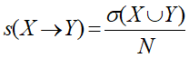
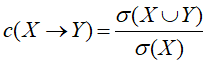
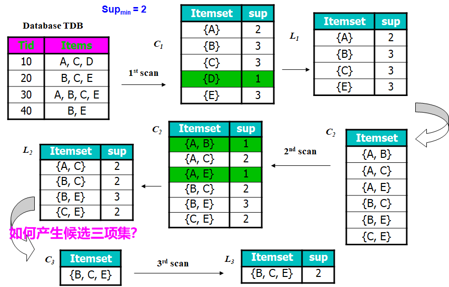
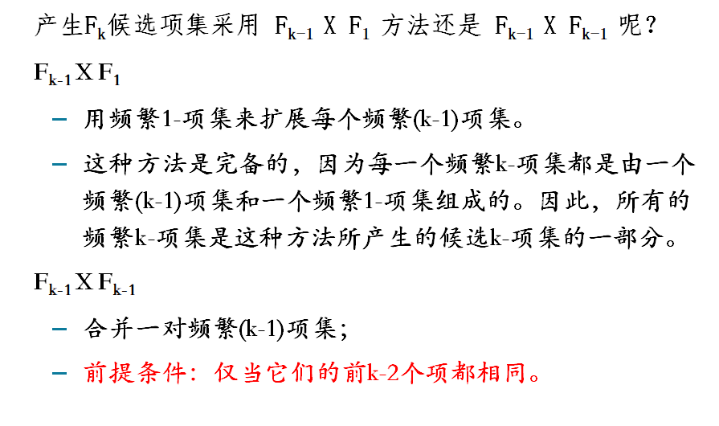
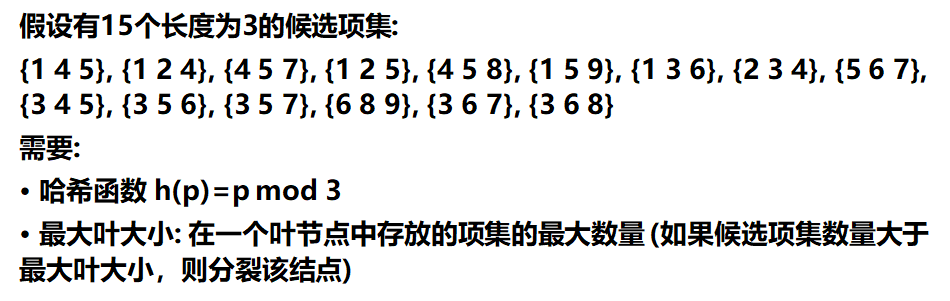
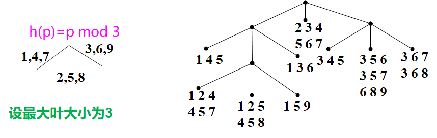
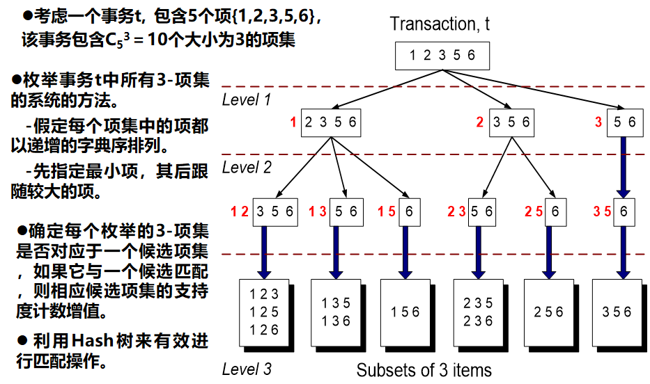
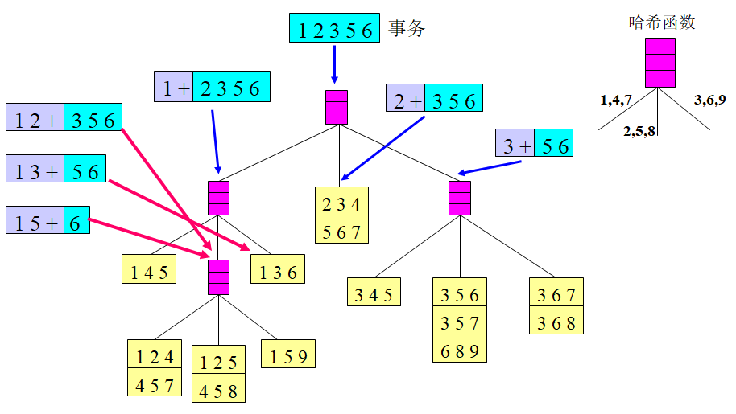

# 关联分析

***

## 频繁模式

频繁出现在数据集中的模式，如项集、子序列

- ### 频繁项集

  - 频繁同时出现在交易数据集中的商品（其实就是出现频繁出现在记录中的字段），一般是多项，比如二项，三项一直到N项

- ### 子序列

  - 一系列动作，有先后的那种

## 支持度计数、支持度和置信度

- 支持度计数就是一个项集出现的次数，类似于频数

- 支持度就是项集出现的次数除以总数就是，用公式表达如下：

  

  ​	注意:这里的X和Y的意思是X--->Y这个意思，是一种关联表达式，例如{牛奶，尿布}------>{啤酒}，就是这个意思，而公式就是{牛奶，尿布，啤酒}出现的次数，除以总的记录数。

- 置信度是指所有含X的记录中，有Y的比例，公式如下：

  

  **我们可以通过设置特定阈值来判断是否关联。**

  **支持度 ≥  阈值**

  **置信度 ≥阈值**

  ## 关联规则挖掘-Apriori算法

  ### 候选频繁项集的生成

  频繁项集需要非常大的工作量用组合数算出，如果有d个项，要2^d-1个项集，这么大的数字需要缩小，所一候选项集需要优化。

  Apriori的核心就是**只要一个项集不频繁，那他的超集就也不会频繁，从而消除这个项。如果一个项集是非频繁的，则子集一定是非频繁的。**

  

  

这里L2一定是按照字典顺序排列，这样就可以更好判断。

### Apriori算法**—**支持度的计数

因为匹配支持度需要非常大的工作量，所以要进行优化来减少匹配此处，我们采用hash算法来简化操作

这里解释一下，hash算法就是用数字一个一个除以3，然后就分类，一个叶子不能超过三个个体。用这个案例来说，我们先将第一个数字除以3，然后余数分开（1，4，7）写最左边，(2,5,8)写中间，(3,6,9)写最右边，然后按照第二个数字，，在第一个节点，4只有一个，2有多个写出来，然后3也是只有一个，一直分下去，就可以得出这个图。

**然后就是匹配问题了，需要将项目分类**

