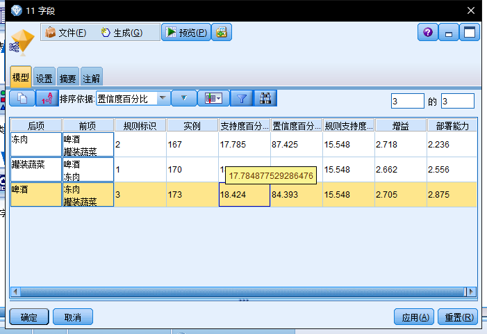

# 关联分析

***

## 频繁模式

频繁出现在数据集中的模式，如项集、子序列

- ### 频繁项集

  - 频繁同时出现在交易数据集中的商品（其实就是出现频繁出现在记录中的字段），一般是多项，比如二项，三项一直到N项

- ### 子序列

  - 一系列动作，有先后的那种

## 支持度计数、支持度和置信度

- 支持度计数就是一个项集出现的次数，类似于频数

- 支持度就是项集出现的次数除以总数就是，用公式表达如下：

  

  ​	注意:这里的X和Y的意思是X--->Y这个意思，是一种关联表达式，例如{牛奶，尿布}------>{啤酒}，就是这个意思，而公式就是{牛奶，尿布，啤酒}出现的次数，除以总的记录数。

- 置信度是指所有含X的记录中，有Y的比例，公式如下：

  

  **我们可以通过设置特定阈值来判断是否关联。**

  **支持度 ≥  阈值**

  **置信度 ≥阈值**

  ## 关联规则挖掘-Apriori算法

  ### 候选频繁项集的生成

  频繁项集需要非常大的工作量用组合数算出，如果有d个项，要2^d^-1个项集，这么大的数字需要缩小，所以候选项集需要优化。

  Apriori的核心就是**只要一个项集不频繁，那他的超集就也不会频繁，从而消除这个项。如果一个项集是频繁的，则子集一定是频繁的。**

  

  

这里L2一定是按照字典顺序排列，这样就可以更好判断。

之所以k-2项相同，是因为**会有子集**而他的子集不频繁。

### Apriori算法**—**支持度的计数

因为匹配支持度需要非常大的工作量，所以要进行优化来减少匹配此处，我们采用hash算法来简化操作

这里解释一下，hash算法就是用数字一个一个除以3，然后就分类，一个叶子不能超过三个个体。用这个案例来说，我们先将第一个数字除以3，然后余数分开（1，4，7）写最左边，(2,5,8)写中间，(3,6,9)写最右边，然后按照第二个数字，，在第一个节点，4只有一个，2有多个写出来，然后3也是只有一个，一直分下去，就可以得出这个图。

**然后就是匹配问题了，需要将项目分类**

### FP树算法

- FP算法不同于Apriori算法**“产生-测试”**范型。而是使用一种称作**FP树的紧凑数据结构组织数据，并直接从该结构中提取频繁项集**，不用生成候选集
- FP树是一种输入数据的压缩表示，逐个读入事物，把每个事物映射到FP树中的一条路路径来构造。

- FP树**不用生成候选集**，避免了代价稿的数据库扫描
- FP树是一种输入数据的压缩表示，通过逐个读入事务，并把每个事务映射，可能**路径部分重叠**
- 路径重叠越多，使用FP树结构的压缩效果越好

#### 步骤

1. 扫描数据库第一条交易记录，得到第一个分支，**分支一定要按照降频**
2. 扫描第二条交易记录，观察，前几项和第一步相同，后几条不同，所以可以共享**前缀**，后面产生分支。
3. 扫描后面的节点，反复就好

## 序列的相关性度量

> ​	我们可能想分析关于不同时间点上，客户购买东西的分析

那就要将购买东西放在一个时间轴上，类似于下图

### 子序列

在序列上的子序列有些不同地方，就是要按照时间序列，举例

| **Data   sequence**         | **Subsequence**     | **Contain?** |
| --------------------------- | ------------------- | ------------ |
| **<   {2,4} {3,5,6} {8} >** | **<   {2} {3,5} >** | **Yes**      |
| **<   {1,2} {3,4} >**       | **<   {1} {2} >**   | **No**       |
| **<   {2,4} {2,4} {2,5} >** | **<   {2} {4} >**   | **Yes**      |

这个序列中，第一个是子序列，因为按照时间顺序，第二个就不是。

### 序列模式

> 候选序列产生也比较复杂，因为在序列上可以产生很多不同组合，但是也可以用先验原理，就是要注意时间，然后合并。

### 时间约束

- **模式的事件和元素可能要施加时限约束**，比如间隔时间太长，不能确定关联关系。
- **时限约束**可以通过限制序列中两个相继元素之间的时间差来指定
- 如果时间差最大一周，则元素中事件必须在前一个元素事件出现后的一周之内出现
- 如果最小时间差是0
- **==这里要注意，差值要大于最小间隔，而小于等于最大间隔==**，注意一个是**大于**，一个是**小于等于**
- 

# SPSS Modeler操作

### Apriori先验算法

使用先验算法就可以算出支持度和置信度，以及相关关系。

点击全部显示，可以看到这个表格：

- 这个支持度是指前项的支持度。
- 规则支持度才是前项和后项的支持度，就是总共的支持度。
- 增益是指，这个可以认为是这样推荐可以提升2.718倍的效率
- 部署能力是，买了前项没买后项的，部署能力强就可以推荐。
- 规则标识用来判断后面规则的。

用表格输出：

看到选中的，说明这个用户可以推荐冻肉，有87.4%概率，按照规则2.

