# 数据预处理

***

# 概述

## 为什么进行数据预处理

- 数据存在缺失、噪声、不一致的
- 可能还需要合并数据源，选择多个对象和属性，创建和改变属性
- 提升数据质量，提升准确性

## 收集数据存在问题

数据质量包含：**精确性、完整性、一致性、时效性、可信性以及可解释性***

## 数据处理的任务

* 数据清洗
* 数据集成
* 数据删减
* 数据转换

***

# 数据清洗

如果认为数据是**脏数据**就要进行数据清洗

**任务**：

* 填写缺失数据
* 平滑噪声数据，识别需要去除的离群点
* 解决不一致的数据

## 缺失值

- 忽略元组

  - 常常是在**类别标签（目标变量，假定是分类任务）缺失时候这样做**。不是很有效

- 手工填写缺失值

  - **非常耗费时间**

- 使用一个**全局常数**来表示

  - 可以用**未知**，**不明**这种来填写，不推荐

- 使用属性的**中心性测量**来填写缺失值。

  - 标准的的可以用平均值，不标准可以用中值

- 使用**给定元组的类别相同的样本的均值或者中值**

- 使用最可能的值进行填写

  - **值可以由回归或者决策树等进行推理得到。如使用数据集中的其他顾客数据建立一个预测顾客收入值的回归方程，再利用该回归方程来预测缺失的收入值。**

  

  ***

## 噪声数据

噪声数据：**变量的随机错误或者偏差**

### 分箱平滑

步骤：

- 首先排序，并将他分到等深（等宽）的箱中
- 可以按照箱子的**中值，平均值和边界值**进行平滑处理
  - 按照**平均值**：箱中每一个值都被平均值替代
  - 按照**中值**：箱中每一个值都被中值所替代
  - 按照**边界**：箱中的最大最小值被视为边界，，每一个值，被**最近的边界值**替代

#### 等深分箱：按照相同的记录分箱，也就是每箱记录数相同

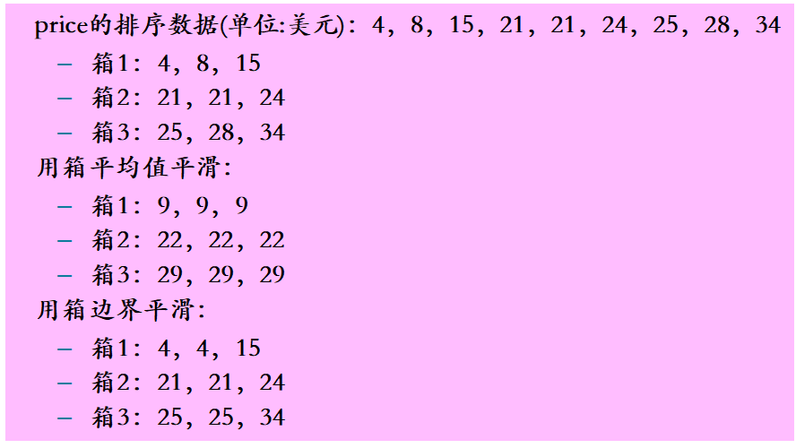

#### 等宽分箱：在整个属性值的区间上平均分布，即每个箱的区间范围设定为一个常量，称为箱子的宽度。

> > > > > 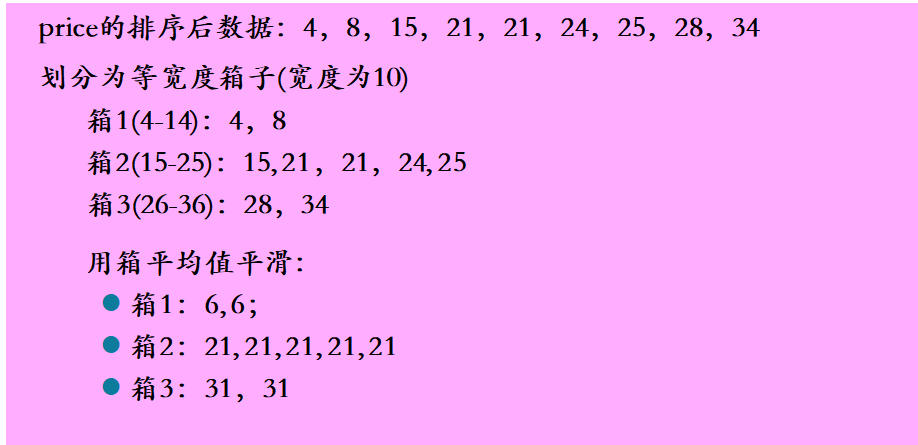

### 回归

用函数拟合来光滑数据

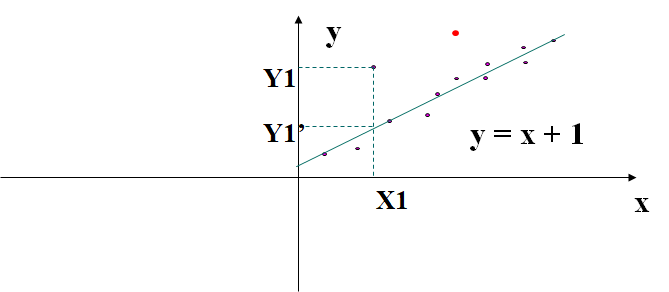

### 离群点分析（聚类分析）

- 通过聚类方法就可以检测离群点，消除噪声

  - **相似或相邻近的数据聚合在一起形成各个聚类集合，而那些位于聚类集合之外的数据对象，被视为孤立点。**

  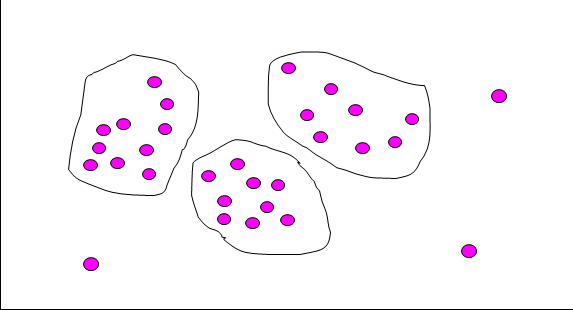

- 通过四分位极差比较发现离群点
- 通过均值和标准差发现离群点

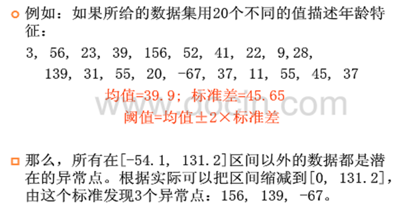

***

>> > # 数据集成
>> >
>> > - 如果数据来自多个数据源，需要进行数据聚合工作，如**聚合数据库、文件**
>> > - 一个给定的概念在不同数据库中有不同的命名，导致了**不一致和冗余**
>> > - **数据集成必须采取措施，防止冗余**
>> >
>> > ## 数据集成存在的问题
>> >
>> > 合并多个文件时候容易出现如下问题：
>> >
>> > - 同名异义
>> > - 异名同义
>> > - 单位不统一
>> > - 字长不一致
>> >
>> > ## 数据集成中讨论的问题
>> >
>> > - 实体识别问题
>> > - 数据冗余问题
>> > - 数据值冲突检测和消除
>> >
>> > ## 数据冗余问题
>> >
>> > 1. 属性冗余：一个属性能从其他属性推导得到
>> >    - 这种冗余可以用**相关性分析**得到
>> >      - 标称属性：**卡方检验**
>> >      - 数值属性：**相关系数和协方差**
>> >
>> > 注意：相关性不代表因果关系
>> >
>> > ### 卡方检验
>> >
>> > 对于标称属性基本相关性都用卡方检验来处理
>> >
>> > 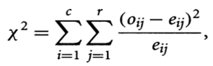

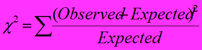

观测的值减去期望值的平方，除以期望值，然后加总

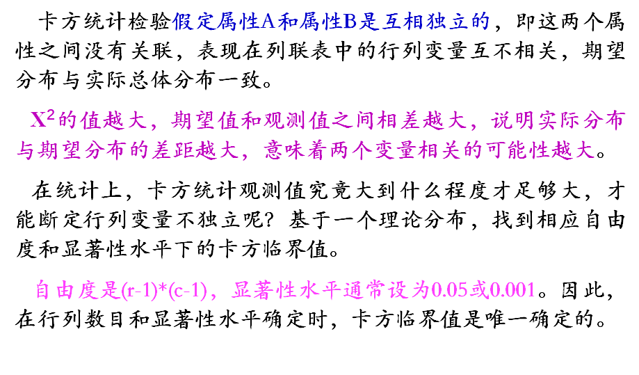

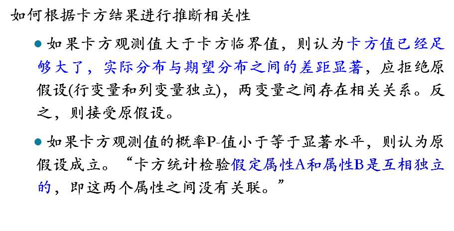

### 协方差

***

# 数据规约/数据删减

减小数据量，就是数据规约

规约之后要产生更小的删减集，但是要得出相同的结果

- 数据规约包括：**维规约，数量规约以及数据压缩**
- 维规约主要是减少随机变量的个数，其实就是减少属性的个数

## 属性子集选择

## 数据块规约

- 参数方法：使用模型来评估
- 非参数方法：存放直方图、聚类、抽样以及数据立方的形式来表示的删减数据

## 抽样

无置换简单随机抽样（SRSWOR）：就是不放回

有置换的简单随机抽样（SRSWR）:这个要放回

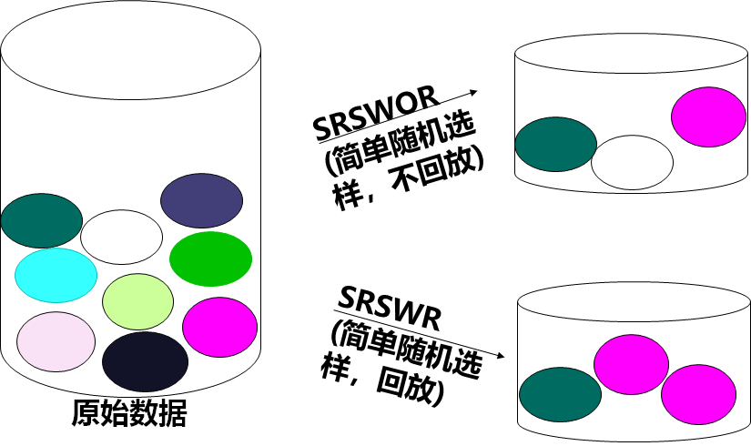

***

# 数据转换

## 将数据转换为适合挖掘的形式

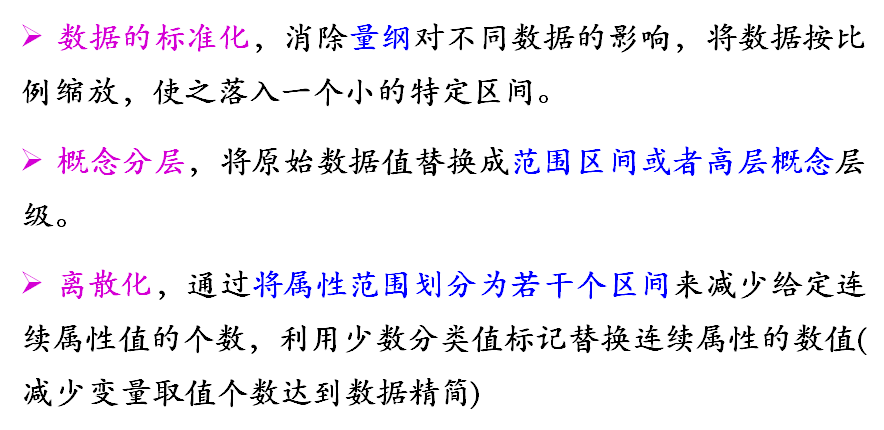

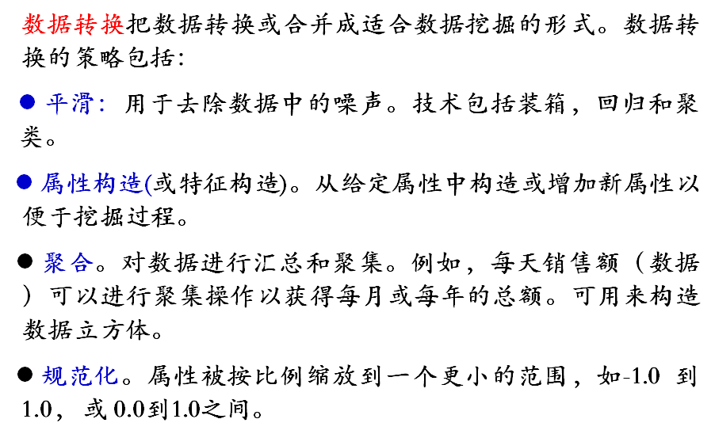

## 规范化

### 最小最大值标准化

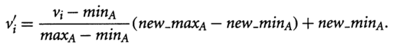

### Z分数标准化

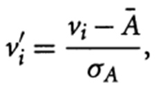

数字减平均值，除以标准差

****这种方法在**实际的最小值和最大值未知时很有用**，或者离**群点主导了最小－最大值的标准化**时。

