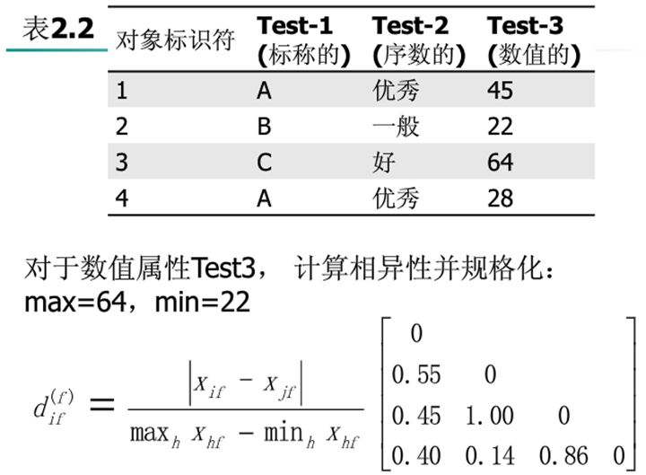

# 认识数据

## 数据的属性

属性有多种称法，比如**维，特征和变量**都是属性的意思

行也有很多叫法，比如**记录、点、向量、案例、样本、实例**等都是行的意思

| 属性类型 | 描述                                                         | 例子                     | 操作                           |
| -------- | ------------------------------------------------------------ | ------------------------ | ------------------------------ |
| 标称     | 仅仅只是不同的名字，标称的值只是能够提供信息，区分对象，**没有排序意义，只能用=或！=来判断** | 邮政编号、身份证号、性别 | 众数、熵、列相关               |
| 序数     | 序数属性的值提供足够的信息确定对象的序，这个除了=还可以用<>来判断 | 成绩                     | 中位数、众数、符号检验、秩相关 |
| 区间     | 对于区间属性值之间的差有意义可以+—，这里是由人为测度         | 温度、日期               | 均值、标准差、t和F检验         |
| 比率     | 可以+—*/                                                     | 绝对温度、货币量、年龄   | 几何平均，调和平均、百分比变差 |

## 数据统计的基本描述

### 中心趋势度量

- 截尾均值：就是去掉极端值（最大值和最小值）的均值
- 中列数：最大和最小的数的均值

#### 上限公式和下限公式

有可能会有用组距来描述的，无法直接找到中位数，比如

这时候就要用上限公式和下限公式来确定年龄的中位数

上限公式：

下限公式：

- U——中位数所在组的上限
- L——中位数所在的组的下限
- 这里的——所有的频数加起来除以2
-  **S**m-1——中位数所在组以下的累计次数
- Sm+1——中位数所在组以上的频数
- f~m~——中位数所在组的个数
- d——组距

#### **对称与正倾斜和负倾斜数据的中位数、均值和众数**

**绿色字体：中位数****；**红色字体：众数**；**蓝色字体：均值**

## 

#### 分位数

- 二分位数：就是中位数
- 四分位数：25%，50%，75%，三个数据点
  - 四分位数极差：IQR=Q3-Q1,就是用75%的数据点减去25%的数据点
  - **孤立点**：通常是挑选落在**第三个四分位数之上**或**第一个四分位数之下**至少1.5 x IQR的值

#### 五位概括

这个就是用四分位数（这里有3个点）、最大最小值描述

#### 盒图

- 盒图最上面是最大值（只要最大值不是离群点）
- 盒图最下面是最小值
- 中间盒子状，下面是25%点，上面是75%点
- 中间那个线是中位线

#### 方差和标准差

## 基本描述的图形显示来

### 分位数图

- 观察**单变量分布**的简单有效方法
- 显示所有数据
- 

### 直方图

- x的值是被划分成不相交的连续子域
- 每个筒用一个矩形表示，高度等于**频率**
- 如果属性是数值的话，就是频率直方图，如果是分类的话就是**条形图**

### 散点图

观察**双变量**数据的有效方法，可以用来观察相关性的

### 网状图

用来观察离散变量间的关系

## 相似性和相异性

**相似性多用相异度来衡量的，为0到1的数值，0为最相似，1为完全不同**

### 数据矩阵和相异矩阵

- 数据矩阵
  - 

每一行都是一个对象，每一列都是一个属性

- 相异矩阵
  - 

这个d(2,1)的意思是第二个对象和第一个对象的相异值

### 单个属性的临近度衡量

#### 标称

我们衡量test-1的相似程度，绘制矩阵

#### 序数

- 序数属性是有一定顺序的需要排列
- 相对位置更加重要所以要标准化

**相异度计算方法**：

1. 属性f有Mf种状态，将属性f替换为相应等级

   

2. 规划变化：

   

   > ​	这个的意义在把序数的东西标准之后，再去求距离。

3. 距离来度量**

### 多个属性的相似

#### 都为二元型

对称的时候：用不同的除以总的

非对称时候：用不同的除以减去00的，因为都为负例的太多了，会影响

#### 数值型

- 一般用**闵可夫斯基距离**来衡量

这是距离衡量的一般公式

- h=1,就是绝对值

- h=2:欧几里得距离(用的最多哦)
- r=∞：上限距离

****

- 曼哈顿距离
  - 
- 欧几里得距离
  - 

### 混合对象属性之间的相似度量

就是加权平均

| **对象标识符** | test-1(标称的) | **test-2(序数的)** | **test-3(数值的)** |
| -------------- | -------------- | ------------------ | ------------------ |
| **1**          | **code-A**     | **优秀**           | **45**             |
| **2**          | **code-B**     | **一般**           | **22**             |
| **3**          | **code-C**     | **好**             | **64**             |
| **4**          | **code-A**     | **优秀**           | **28**             |

这个就是test-1和test-2的矩阵

这个是计算test-3的

这里是以权重为1，计算

### 稀疏数值向量的度量——余弦测度

