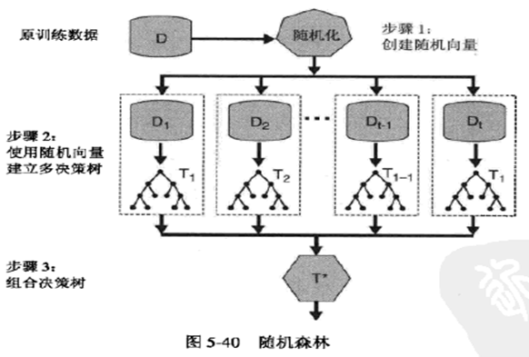
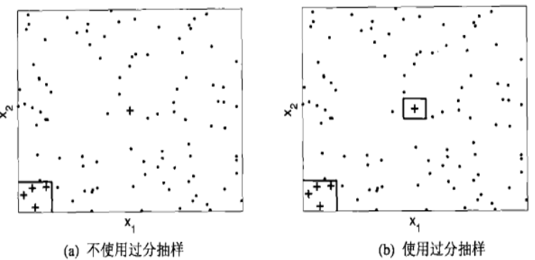

# 模型评估

> ​	这章是个综合类的章节，主要讲述模型各类模型的评估

## 假设空间

- **归纳**是从特殊到一般
- **演绎**是从一般到特殊，从基础原理推演出具体状况

当训练集看成是一个**在所有假设组成的空间中进行搜索的过程，搜索目标是找到与训练集匹配的假设**

****

学习过程都是基于**有限的样本训练集进行**，因此可能有多个假设与训练集一致，**存在这一个与训练集一致的“假设集合”，称为“版本空间”**。

## 归纳偏好

==**如何的机器学习算法有其特定偏好**==

特定的问题，不同的算法效果不同

**学习算法自身的归纳偏好与问题是否匹配，往往是起决定性作用**

## 经验误差和过拟合

> 我们都想找到**泛化能力强**的学习方法，但是如何评估呢？

- 错误率
  - 分类错误样本占总样本数的比例
- 精度
  - 1-错误率
- 误差
  - 学习器的实际预测输出与样本真实输出之间的差异
    - 训练误差：训练集上的误差
    - 泛化误差：新样本上的误差

> 过拟合和欠拟合的概念就不用多讲了，欠拟合容易克服，**过拟合是关键障碍**，无法彻底避免，只能缓解

## 评估方法

> 测试集和训练集这个概念理解就好，不多讲，主要是怎么获得测试集

### 获得测试集的方法

#### 留出法

> 将数据集分别训练集和测试集，用训练集来学习，用测试集来进行检测。

**注意**：

- 保持数据分布的一致性
- 留出不同，不同划分，很有可能结果不同，所以**单次使用留出法无法得到稳定的结果，一般采用若干次随机划分，重复实验，平均值，作为结果**
- 拥有的数据集本来就是假设空间的一部分数据，测试集多少比较难定（一般用==**1/5~1/3样本做测试集**==

#### 交叉验证法

> ​	将数据集划分成K个大小相同的子集，**每个子集都尽可能保持分布一致**，从D中采用分层抽样

这里还有一个**K折交叉验证**，因为划分也是存在偶然性的，使用随机使不同的划分重复P次，P次K折交叉验证结果的均值

#### 留一法

> 每次都留一个作为验证的，类似于交叉验证。

- 不受样本划分的分布影响，而且模拟很相似，很准确
- 缺点也明显，计算量大

#### 自助法

> ​	因为留出法和交叉验证发，都会保留一部分作为测试，模型评估会受到样本规模不同影响。

自助法采用**有放回采样**这样就保证了**训练集和样本集有相同的规模**，但是会**有样本不出现**，且**数据分布会改变的**

## 集成学习/组合方法

> ​	**聚集多个分类器的预测来提高分类准确率**，这被称为**组合或分类器组合方法**

- 从训练数据中构建一组**基分类器**
- 根据多个分类器预测来决定一个记录的类别标签（**加权投票或者平均值**）
- 这种集成中只包含**同中类型的个体学习器**
- 这个对“弱学习器”较为明显

**组合分类器示例**

******

**基本思想：**

- 训练集大小一般与原始数据集保持一致
- 组合方法对于**不稳定的分类器**效果较好，比如**决策树，基于规则的分类器和神经网络**
- 可以采用**少数服从多数进行表决**，可用基分类器的准确率**加权投票**

****

在**原始数据上构建多个分类器，然后在分类未知样本时聚集预测结果**，构建方法：

- 通过处理**训练数据集**：bagging和boosting技术
- 通过处理**输入特征**：随机森林（对含有大量冗余特征的数据集处理性能非常好）

- 通过处理**类标号**：适用于目标类数目比较多的情况
- 通过处理**学习算法**：通过改变模型中的参数

****

boosting和bagging具体要看一篇文章就很好懂：<https://becominghuman.ai/ensemble-learning-bagging-and-boosting-d20f38be9b1e>

****

### 随机森林

> ​	随机森林（Random Forest,PF）是一个专门为**决策树**分类器设计的组合方法

传统决策树在属性选择使用贪婪算法，而在RF中，**对于决策树每个节点，先从节点的属性集合中随机选择一个包含K个属性的子集**，然后从这个子集中选择最优属性用于划分。

随机森林相比bagging不同的是，不仅对**样本进行扰动**，而且还对**属性进行扰动**

## 不平衡类型问题

> 我们经常会遇到一些不平衡问题，比如拖欠贷款不还的毕竟是少数，对于这种分析，很容易受到多数的影响，所以要进行操作。

### 不平衡类问题——样本平衡处理

**抽样**是处理不平衡问题的方法，在不平衡数据集，稀有类比多数类更加有意义。**对于二元分布**，稀有类通常为**正类**，而多数类称为**负类**。抽样主要是为了改变分布，从而**帮助稀有类在训练数据集中得到更好的表示**

- 过抽样

  过抽样也称为向上抽样，通过**复制**样本，直到训练集中**正样本和负样本**一样多

  

  这样有一个弊端，**噪声样本**很可能被复制，导致噪声样本复制多次。

- 不充分抽样
  - 通过**去掉负类**来得到相同的样本
  - 问题也明显，有些负样本没有抽中，可能欠拟合
  - 解决办法：
    - 多次执行不充分抽样，并归纳类似于组合学习方法的多分类器
    - 聚焦的不充分抽样，即抽样程序精确的确定应该排除那些负样本，比如远离决策边界样本

## 性能度量

准确率度量将每个类看得同等中哎哟，不适合用来分析不平衡的数据集

- 这个在原来讲过，在决策树在里面讲过，可以使用一下。

